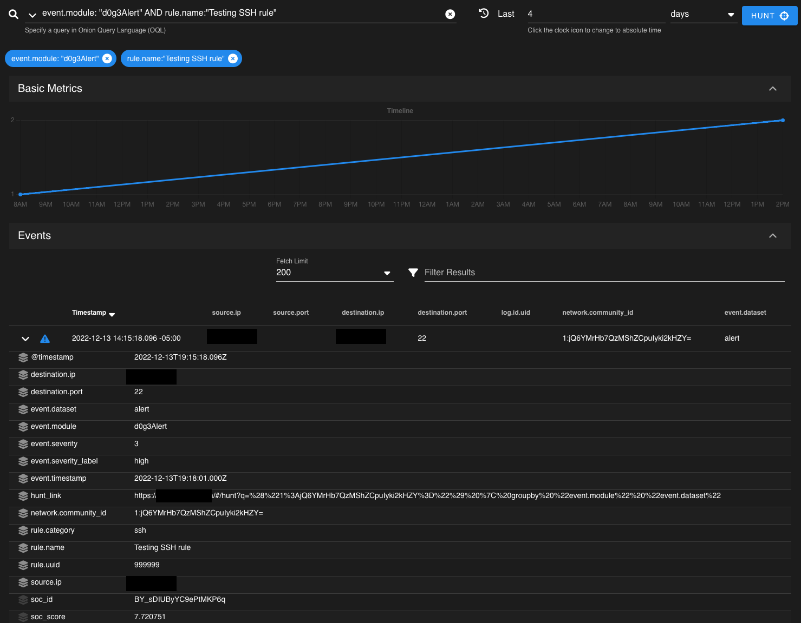

# d0g3Alert

## Introduction

This Elastalert alerter was created with Security Onion in mind, but it can be utilized for any elastalert deployment. The purpose of this alerter is to create a doc in a new or existing index that you can easily refer back to. Elastalert does this by default, but that log is more for logging purposes as opposed to highlighting interesting activity within the environment. This way you can have a separate index for alerts. 



## Get Started

To utilize this module as-is, copy the repo and add `d0g3Alert-es.py` to the `elastalert/modules/custom/` directory. After placing it there, restart the Elastalert service. You will also need to restart the service any time you modify an alerter.

Once you have the alerter in-place, you can utilize the `d0g3alert-template.yaml` template file to create your first alert.

If you would like to have it generate a link to pivot to, be sure to change the hostname in lines 130.
```Python
        payload.update({'hunt_link': 'https://<replace with secOnion host address>/#/hunt?q='+create_link(match, self.rule['link.filters'])})
```          

## Put it in Prod

Start by ensuring the `elasticsearch_host` location is correct. The template requires 4 fields to work; `rule.title, rule.id, rule.category, rule.severity`. 

*Example Required fields:*
```Yaml
# Elasticsearch Host
elasticsearch_host: "localhost:9200"

# (Required)
# Rule name, must be unique
name: Template D0g3Alert

# required fields for D0g3Alert
rule.title: "Template D0g3Alert"
rule.id: "999999"
rule.severity: 3
rule.category: "ssh"
```

Once the required fields have been setup, we can move onto the optional fields; `event.fields, event.module, event.dataset, mitre.id, mitre.name, link.filters`

*Example Optional fields:*
```Yaml
# optional fields
# Default is alert
event.dataset: "alert"
# Default is d0g3Alert
event.module: "d0g3Alert" 
# fields to add to EA generated doc, must be list
event.fields: 
  - '@timestamp'
  - destination.ip
  - destination.port
  - source.ip
  - network.community_id
# Mitre Fields
# ID for the alert
mitre.id: T1021
mitre.name: Remote Services
# Hunt link filter fields. must be list
link.filters:
  - network.community_id
  - log.id.uid
```

**Field Descriptions**
- *Required Fields*
  - `rule.title`
    : The name of the rule.
  - `rule.id`
    : ID for the rule. Can be used for rule tracking and tuning.
  - `rule.category`
    : Specify a category for the rule.
  - `rule.severity`
    : Specify the Severity as an integer of 1-4. It will add an additional `severity_level` field. The severities will translate as follows; 1:low, 2:medium, 3:high, 4:critical.
- *Optional Fields*
  - `event.dataset`
      : Defaults to `alert` if omitted from rule
  - `event.module`
      : Defaults to `d0g3alert` if omitted from rule
  - `event.fields`
      : Specify fields that you want to be pulled from the matching doc and written to the new alert doc. Defaults to all fields from matching doc if omitted from rule
  - `mitre.id`
      : Specify the Mitre technique ID associated with this rule. If omitted, the field will not populate. Maps to `rule.mitre.id`.
  - `mitre.name`
      : Specify the Mitre technique name associated with this rule. If omitted, the field will not populate. Maps to `rule.mitre.technique`.
  - `link.filters`
      : Creates a new field called `hunt_link` and generates a link based on the fields provided. If omitted, the field will not populate.

**Elastalert Fields**
As with any Elastalert rule, you will need to specify the type, index, and filters. More info about those can be found in the [Elastalert Docs](https://elastalert.readthedocs.io/en/latest/running_elastalert.html#creating-a-rule)

Example Rule type and filter:
```Yaml
# alert type / filter
type: any
index: "*:so-zeek-*"

filter:
- query:
    query_string:
      query: "destination.port:22"
```

